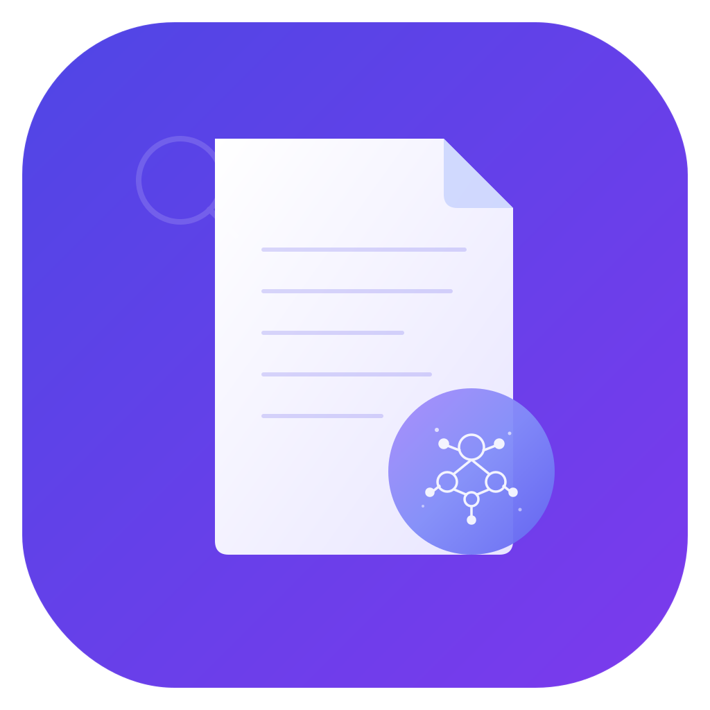

# DocuMind - AI 문서 관리 데스크톱 앱

<p align="center">
  
</p>

<p align="center">
  <strong>AI 기반 스마트 문서 관리 솔루션</strong><br>
  문서를 자동으로 분류하고, AI로 작성하고, 클라우드와 동기화하세요.
</p>

<p align="center">
  <a href="https://github.com/rirang1123/documind/releases/latest">
    
  </a>
</p>

---

## 다운로드

> **[최신 버전 다운로드](https://github.com/rirang1123/documind/releases/latest)**

| 파일 | 설명 |
|------|------|
| `DocuMind_x.x.x_x64-setup.exe` | Windows 설치 파일 (NSIS) |
| `DocuMind_x.x.x_x64_en-US.msi` | Windows 설치 파일 (MSI) |

설치 후 앱 내에서 자동 업데이트를 지원합니다.

---

## 주요 기능

### AI 문서 작성
- OpenAI, Anthropic (Claude), Google AI 연동
- AI가 문서를 자동 생성하고 검토
- TipTap 기반 리치 텍스트 에디터
- Word, PowerPoint, PDF, Excel 등 다양한 형식으로 내보내기

### 스마트 문서 분류
- **3단계 분류 시스템**: 규칙 엔진 + AI + 학습 기반
- 문서를 기획, 보고, 평가, 회의, 계약, 재무, 참고자료 등으로 자동 분류
- 드래그 앤 드롭으로 파일 추가 시 자동 분류

### 프로젝트 기반 관리
- 프로젝트별로 문서를 체계적으로 관리
- 카테고리 폴더 자동 생성
- 로컬 디스크 저장소와 동기화

### 파일 미리보기
- docx, xlsx, pptx, pdf, txt, md 파일 미리보기 지원
- 편집은 OS 기본 앱으로 열기 (뷰어 중심 설계)

### Google Drive 연동
- OAuth 2.0 + PKCE 인증
- Drive 파일/폴더 가져오기 & 내보내기
- 폴더 구조 유지 또는 AI 자동 분류 선택 가능
- Google Workspace 파일 자동 변환 (Docs→docx, Sheets→xlsx, Slides→pptx)

### 보안
- API 키와 자격증명은 OS Keychain에 안전하게 저장 (Windows Credential Store)
- IndexedDB에 민감 정보 저장하지 않음

### 자동 업데이트
- 앱 내에서 새 버전 자동 감지 및 업데이트

---

## 기술 스택

| 영역 | 기술 |
|------|------|
| Frontend | React, TypeScript, TailwindCSS |
| Desktop | Tauri v2 (Rust) |
| Build | Vite |
| Editor | TipTap |
| DB | Dexie (IndexedDB) |
| 보안 | OS Keychain (keyring crate) |
| 상태관리 | Zustand |
| AI | OpenAI API, Anthropic API, Google AI API |
| Cloud | Google Drive API v3 |
| CI/CD | GitHub Actions |

---

## 스크린샷

> 앱 실행 후 저장소 폴더를 선택하면 메인 화면으로 진입합니다.

---

## 개발 환경 설정

### 필수 요구사항
- Node.js 20+
- Rust (stable)
- Windows 10/11

### 설치 및 실행

```bash
# 의존성 설치
npm install

# 개발 모드 실행
npx tauri dev

# 프로덕션 빌드
npx tauri build
```

---

## 라이선스

이 프로젝트는 개인 프로젝트입니다.
